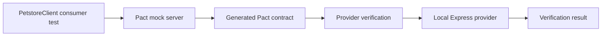
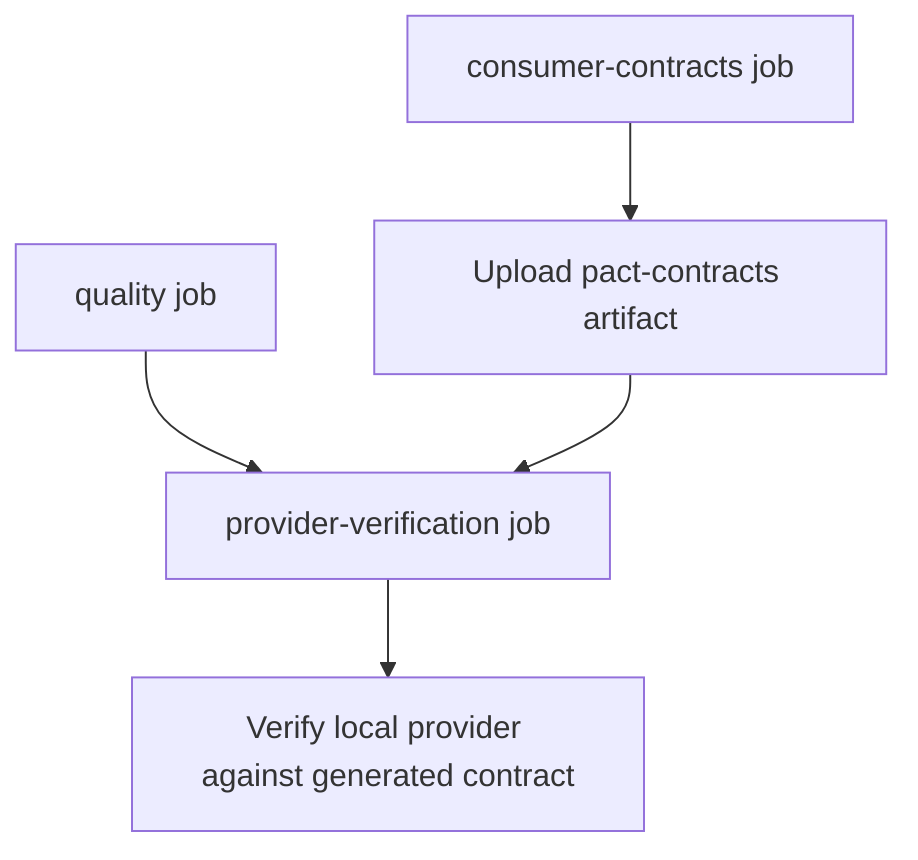

# Consumer And Provider Flow

This project demonstrates consumer-driven contract testing between a small
TypeScript client and a local Express provider.

```text
Petstore Web/Mobile Client  --->  Petstore API
        Consumer                    Provider
```

## Contract Testing Flow



## What Happens Locally

1. Consumer Pact tests start a Pact mock server.
2. `PetstoreClient` sends requests to the mock server.
3. Pact verifies that the consumer made the expected requests.
4. Pact writes the generated contract to `pacts/`.
5. Provider verification starts the local Express provider.
6. Pact replays the contract interactions against the provider.
7. The provider response is checked against the generated contract.

## What Happens In CI



The provider verification job depends on the generated Pact artifact from the
consumer test job. This keeps the pipeline honest: provider compatibility is
checked against the consumer contract, not against duplicated provider-side
assumptions.

## Why The Live Petstore API Is Not Used In CI

The public Swagger Petstore demo API is useful as a reference, but it is not a
stable CI dependency. Public demo APIs can reset data, change behavior, rate
limit requests, or become unavailable.

The local provider keeps the contract testing flow deterministic:

1. Consumer expectations are generated as a Pact contract.
2. Provider verification uses that generated contract.
3. CI does not depend on mutable public demo data.
