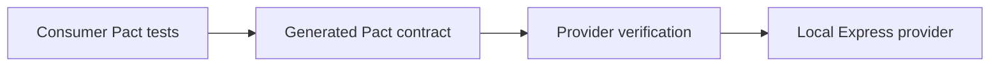

# Contract Testing Basics

Contract testing checks whether two systems agree on how they communicate. It is
especially useful when one service depends on another service over HTTP, events,
queues, or another integration boundary.

In this project, the integration boundary is simple:

```text
PetstoreClient  --->  PetstoreAPI
   Consumer            Provider
```

The consumer is the code that needs something from another system. The provider
is the system that receives the request and returns a response.

## The Core Idea

Instead of testing a full deployed environment end to end, contract testing
captures the expectations one side has about the interaction and verifies that
the other side can satisfy those expectations.

With Pact, the usual consumer-driven flow is:

1. The consumer test describes the request it will send.
2. The consumer test describes the response it needs.
3. Pact runs a mock provider and checks the consumer request.
4. Pact writes those expectations into a contract file.
5. Provider verification replays the contract against the real provider
   implementation or a stable local provider fixture.
6. The provider passes only if it can satisfy the generated contract.

## Consumer

The consumer is the application or component that depends on another API.

In this repository, the consumer is:

```text
src/consumer/petstoreClient.ts
```

`PetstoreClient` needs these provider behaviors:

- return a pet by ID;
- return pets filtered by status;
- create a pet and return the created pet body.

The consumer tests define those expectations first. This is why the approach is
called consumer-driven contract testing.

## Provider

The provider is the API that must satisfy the consumer's expectations.

In this repository, the provider is a local Express app:

```text
src/provider/app.ts
```

The local provider implements a small subset of the Swagger Petstore API. It is
used for deterministic provider verification instead of depending on the public
Petstore demo API in CI.

## Contract

The contract is the generated Pact file that records the consumer's expected
interaction with the provider.

In this repository, the generated contract is:

```text
pacts/PetstoreClient-PetstoreAPI.json
```

The contract includes:

- provider state names;
- expected HTTP method and path;
- expected query parameters;
- expected request headers and body;
- expected response status, headers, and body;
- matcher rules for flexible compatibility checks.

## Provider State

A provider state describes the setup the provider needs before an interaction can
be verified.

Example provider states in this project:

- `pet with ID 123 exists`;
- `available pets exist`;
- `provider accepts new pet creation`.

Provider states keep verification deterministic because each interaction prepares
the data it needs before Pact replays the request.

## Matchers

Pact matchers describe compatibility rules. They help avoid brittle tests that
compare every response value exactly.

For example, a consumer usually cares that `id` is a number and `status` is a
valid Petstore status. It usually does not need every compatible provider to
return only one hard-coded example forever.

This project uses matchers for:

- integers;
- strings;
- arrays;
- enum-like status values;
- JSON content type headers.

See [Pact Matchers](pact-matchers.md) for the project-specific matcher guide.

## API Tests vs Contract Tests

API tests usually ask:

```text
Does this deployed API behavior work right now?
```

Contract tests usually ask:

```text
Can the provider satisfy the consumer's agreed expectations?
```

Both are useful, but they solve different problems. API tests are often better
for checking deployed behavior and workflows. Contract tests are better for
protecting integration compatibility between independently changing systems.

## Why This Project Uses A Local Provider

The public Swagger Petstore API is useful as a learning reference, but it is not
a reliable CI dependency. Public demo APIs can reset data, change behavior, rate
limit requests, or become unavailable.

The local Express provider keeps the contract testing pipeline stable:



This shows the important Pact workflow without making CI depend on mutable public
demo data.

## What A Passing Contract Test Means

A passing consumer Pact test means:

- the consumer can call the provider in the expected way;
- the expected interaction was written into a Pact contract;
- the consumer code works against the generated mock provider response.

A passing provider verification means:

- the provider can satisfy the generated consumer contract;
- expected provider states can be prepared;
- request and response compatibility is preserved.

It does not mean every provider feature is tested. It means the provider remains
compatible with the consumer expectations captured in the contract.

## Practical Workflow

When changing a contract interaction:

1. Update or add the consumer Pact test.
2. Use matchers for flexible response compatibility.
3. Run `npm run test:consumer` to generate the Pact file.
4. Review the generated Pact file.
5. Update provider state setup if the interaction needs new fixture data.
6. Run `npm run test:provider`.
7. Run `npm run test:contract` before opening a pull request.
