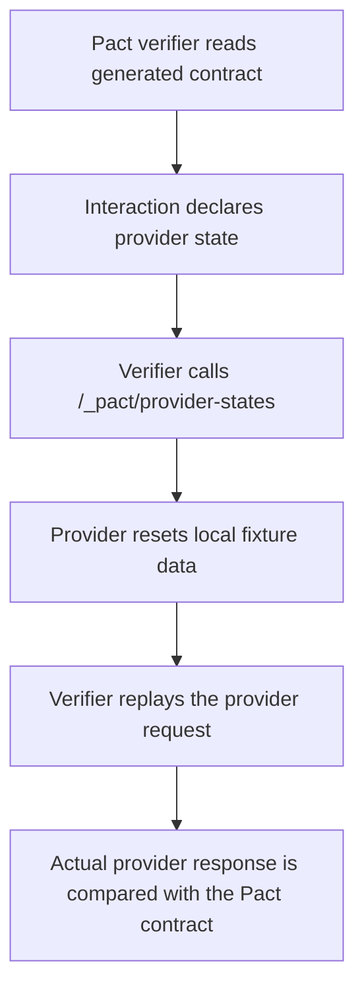

# Provider States

Provider states describe the data or behavior the provider must prepare before a
specific Pact interaction is verified.

In this project, provider states keep provider verification deterministic. The
provider test starts a local Express app, enables a test-only Pact state setup
endpoint, and lets Pact call that endpoint before verifying each interaction.

## Why Provider States Exist

Consumer Pact tests describe expectations such as:

- `pet with ID 123 exists`;
- `available pets exist`;
- `provider accepts new pet creation`.

Those state names are written into the generated Pact contract. During provider
verification, Pact reads the contract and asks the provider to prepare the
required state before replaying the request.

This avoids hidden dependencies on mutable remote data or a shared test
environment.

## Local State Setup Endpoint

The provider verification test creates the app with Pact state setup enabled:

```ts
const app = createProviderApp({ enablePactStateSetup: true });
```

That enables this test-only endpoint:

```text
/_pact/provider-states
```

The normal provider server does not need to expose this route. It is only used
by the Pact verifier in the provider verification test.

## Verification Flow



## Current Supported States

The supported provider states live in:

```text
src/provider/providerStates.ts
```

Current states:

| Provider State                      | Purpose                                                                    |
| ----------------------------------- | -------------------------------------------------------------------------- |
| `pet with ID 123 exists`            | Ensures `GET /v2/pet/123` can return the expected pet.                     |
| `available pets exist`              | Ensures `GET /v2/pet/findByStatus?status=available` returns matching data. |
| `provider accepts new pet creation` | Ensures `POST /v2/pet` can echo the created pet shape.                     |

## Fixture Reset

The provider state setup handler calls `resetPets()` before setup. This restores
the local in-memory fixture data from `src/provider/testData.ts`.

That reset matters because provider verification should not depend on the order
in which interactions run.

## Teardown Behavior

The setup handler accepts Pact teardown requests but does not reset fixture data
during teardown. The current project resets data during setup instead, which is
enough for deterministic verification because every interaction prepares its own
required state before the request is verified.

## Unsupported States

If Pact asks for a state that is not registered, provider verification fails
fast:

```text
Unsupported provider state: missing pet exists
```

This is intentional. A missing state means the generated Pact contract expects a
scenario the provider test fixture does not know how to prepare.

## Adding A New Provider State

When adding a new Pact interaction:

1. Add a meaningful `.given(...)` state to the consumer Pact test.
2. Add that state name to `supportedProviderStates`.
3. Update the setup logic if the state requires new fixture data.
4. Add or update provider state unit tests.
5. Run `npm run test:consumer` to regenerate the Pact contract.
6. Run `npm run test:provider` to verify the provider.

Keep provider state names readable and consumer-focused. They should describe
the scenario the consumer needs, not the provider's internal implementation.
